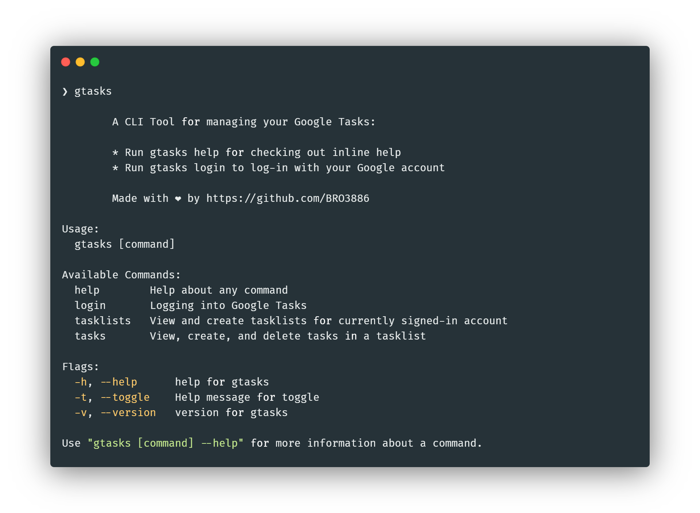

# Google Tasks CLI

`gtasks`: A CLI Tool for Google Tasks



---

## Docs

Refer to the [docs website](https://gtasks.sidv.dev) to read about available commands.

## AI Agent Skills

GTasks includes an embedded [Agent Skill](https://agentskills.io) that can be installed for supported AI agents.

**Supported targets:**
- Claude Code via `~/.claude/skills/gtasks-cli/`
- Codex-compatible agents via `~/.agents/skills/gtasks-cli/`
- OpenClaw via `~/.openclaw/skills/gtasks-cli/`

**Commands:**

```bash
gtasks skills status
gtasks skills install
gtasks skills install --agent codex
gtasks skills uninstall --agent codex
```

**For contributors:** the canonical skill files live in [`internal/skills/assets/gtasks-cli/`](internal/skills/assets/gtasks-cli/).

## Installation

### Homebrew

```bash
brew tap BRO3886/tap
brew install gtasks
```

**macOS / Linux (install script):**

```bash
curl -fsSL https://gtasks.sidv.dev/install | bash
```

Installs to `~/.local/bin` by default. Override with `INSTALL_DIR`:

```bash
INSTALL_DIR=/usr/local/bin curl -fsSL https://gtasks.sidv.dev/install | bash
```

**Manual install:** Download the binary for your system from [releases](https://github.com/BRO3886/gtasks/releases), move it to a directory in your `PATH`, and `chmod +x gtasks`.

**Go install:**

```bash
go install github.com/BRO3886/gtasks@latest
```


## Instructions to Run and Build from Source:

### Prerequisites

- Go 1.24+
- Google Cloud Console OAuth2 credentials (see Configuration section)

### Setup

1. Clone the repository:

```bash
git clone https://github.com/BRO3886/gtasks
cd gtasks
```

2. Set up credentials (see Configuration section below).

### Build Commands

```bash
# Development build
make dev

# Development build with embedded credentials from .env
make dev EMBED_CREDS=1

# Build for specific platforms
make linux    # Linux (amd64 + arm64)
make windows  # Windows (amd64)
make mac      # macOS (amd64 + arm64)

# Build for all platforms
make all

# Create release packages
make release
```

### Configuration

To use GTasks, you need to set up Google OAuth2 credentials:

1. Go to [Google Cloud Console](https://console.cloud.google.com/)
2. Create a new project or select existing one
3. Enable the Google Tasks API
4. Create OAuth2 credentials:

   - Application type: "Web application"
   - Add authorized redirect URIs:
     - `http://localhost:8080/callback`
     - `http://localhost:8081/callback`
     - `http://localhost:8082/callback`
     - `http://localhost:9090/callback`
     - `http://localhost:9091/callback`

5. Supply credentials via environment variables:

```bash
export GTASKS_CLIENT_ID="your-client-id.apps.googleusercontent.com"
export GTASKS_CLIENT_SECRET="your-client-secret"
```

Or add them to `~/.config/gtasks/config.toml` (persistent, no shell profile changes needed):

```toml
[credentials]
client_id     = "your-client-id.apps.googleusercontent.com"
client_secret = "your-client-secret"
```

When building from source, you can also pass credentials at build time:

```bash
make dev EMBED_CREDS=1   # reads GTASKS_CLIENT_ID/SECRET from .env
```

### Token Storage and Configuration

GTasks stores authentication tokens and the optional config file in the same directory.
Discovery order (first existing directory wins):

1. `$XDG_CONFIG_HOME/gtasks/` — XDG standard path; `XDG_CONFIG_HOME` defaults to `~/.config`
2. `~/.gtasks/` — legacy path, used automatically when that directory already exists

New installations use `~/.config/gtasks/` by default.

**Files stored:**

| File | Purpose |
|------|---------|
| `token.json` | OAuth2 token (created on `gtasks login`) |
| `config.toml` | Optional configuration file (created manually) |

See the [Configuration docs](https://gtasks.sidv.dev/docs/configuration/) for the full config file reference.

## Commands

```bash
gtasks --help
```

```
Usage:
  gtasks [command]

Available Commands:
  add         Add a task
  clear       Hide all completed tasks
  completion  Generate the autocompletion script
  done        Mark a task as done
  help        Help about any command
  info        View detailed information about a task
  login       Authenticate with Google Tasks
  logout      Logout currently signed in user
  ls          List tasks
  rm          Delete a task
  skills      Manage AI agent skills for gtasks
  tasklists   Manage tasklists
  undo        Mark a completed task as incomplete
  update      Update an existing task
```

### Auth

```bash
gtasks login
gtasks logout
```

### Tasks

Task commands use the default tasklist when `-l` / `--tasklist` is omitted (`GTASKS_DEFAULT_TASKLIST` or `tasks.default_task_list` in the config file). If no default is set and more than one list exists, you will be prompted to choose one.

```bash
# List tasks
gtasks ls
gtasks ls -l work
gtasks ls --tasklist work --sort due
gtasks ls -i                  # include completed
gtasks ls --completed         # only completed
gtasks ls --format json
gtasks ls --max 10

# Add a task
gtasks add "Buy milk"
gtasks add "Deploy the application" -l work
gtasks add -t "Call dentist" -d tomorrow
gtasks add "Standup" -d "2025-02-10" --repeat daily --repeat-count 5
gtasks add "Weekly sync" -d "2025-02-10" --repeat weekly --repeat-until "2025-03-10"

# Complete / undo
gtasks done 1
gtasks undo 1

# Inspect / update / delete
gtasks info 1
gtasks update 1 --title "New title"
gtasks rm 1

# Hide completed tasks (prompts unless --force)
gtasks clear
gtasks clear --force
```

Task numbers are the 1-based index shown by `gtasks ls`. They can change when the list is sorted or modified.

Repeat patterns: `daily`, `weekly`, `monthly`, `yearly`

### Tasklists

```bash
gtasks tasklists
gtasks tasklists add "Work"
gtasks tasklists add --title "Work"
gtasks tasklists update Work -t "Personal"
gtasks tasklists rm Work
```

### Legacy commands

The older `gtasks tasks view|add|done|...` and `gtasks tasklists view` commands still work as deprecated aliases. Prefer the top-level commands above.

<div align="center">
Made with :coffee: & <a href="https://cobra.dev">Cobra</a>
</div>
